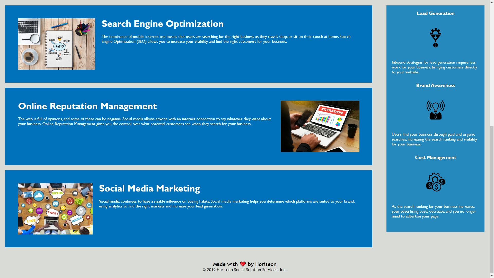

# horiseon-feature-request
## Description
This is a webpage containing information on search engine optimization and its benefits. I worked on this project to help myself learn more about HTML and css and how to organize them. I learned about semantic tags, and image attributes. I learned about the impotance of making both the code and the website itself accessible.

## Installation
N/A
## Usage
This webpage can be read over in its entirety for information, or the navigation links at the top can be used to travel to any specific section.
Page found at:https://ashleybraxton.github.io/horiseon-feature-request/#social-media-marketing

## License
MIT License
